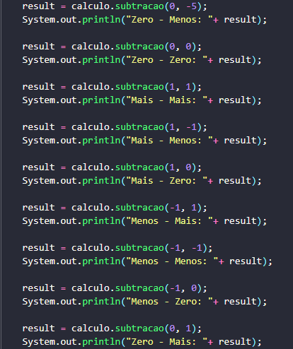

# JUNIT_TEST_CALCULADORA
## DESCRIÇÃO
Calculadora desenvolvida em java com biblioteca JUnit, para teste de software

## Classe Calculadora 

## Classe de Testes
Declaração de variáveis

Soma

Subtração

Multiplicação

Divisão

## Publicação

https://github.com/santn11/Calculadora-JUnit

## Ultima atualização 26/09/2023

